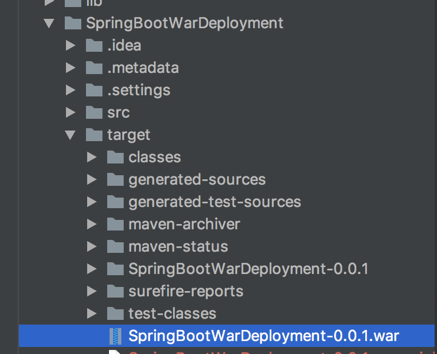
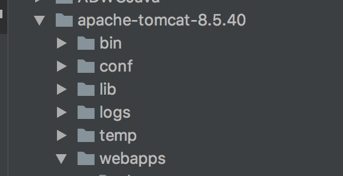

Updated: December 10, 2018

## Introduction

This lab guide will walk you through the process of running the application in Tomcat server.

**_To log issues_**, click here to go to the [github oracle](https://github.com/oracle/learning-library/issues/new) repository issue submission form.

## Objectives

- Create a war file.
- Deploy it in Tomcat Server.
- Run the application.

## Required Artifacts

- An oracle cloud account with Autonomous Data Warehouse Cloud Service.

### **STEP 1**: Create a war file.  
    
- Navigate to the SpringBootWarDeployment directory where the pom.xml file is located.

    

- Run the following command:

    **mvn clean install**

### **STEP 2**: Deploy it in Tomcat Server. 
 
- After the above command is completely executed, navigate to SpringBootWarDeployment/target and you will see a war file.
    
    

- Copy that war file and paste it in your tomcat directory/Webapps.

    

- Rename the war file to test1.war.

### **STEP 3**: Run the application.

- Navigate to the bin folder of the Tomcat Server and run the following command :

    **./catalina.sh run**

    
    

- After the server is up and running, it should look like :

    
    
- Open up your web browser and type:

    **localhost:8080/test1**

    
